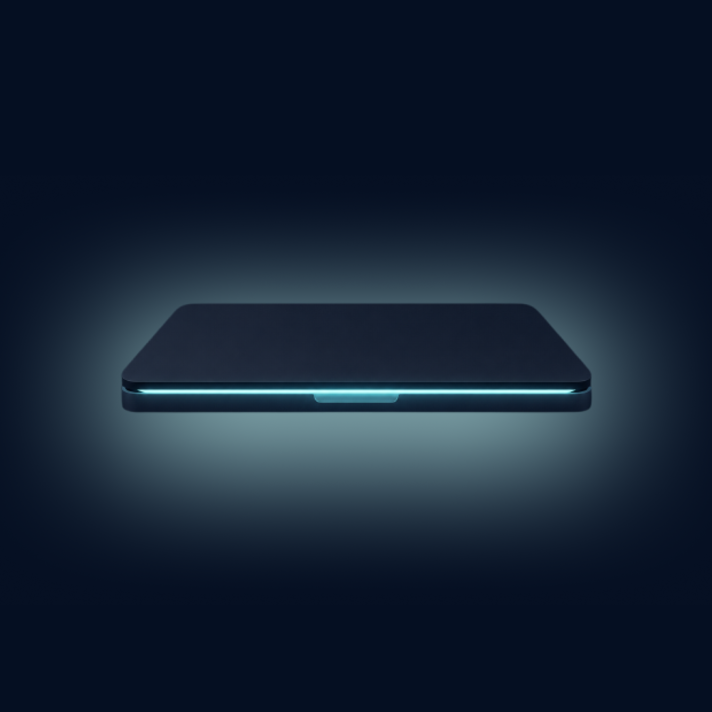

<div align="center">
  
  <h1>Vibe Awake</h1>
  <p>Garde votre Mac éveillé uniquement pendant qu'une session de codage IA travaille réellement.</p>
  <p><a href="../README.md">English</a> · <a href="ja.md">日本語</a> · <a href="zh-Hans.md">简体中文</a> · <a href="ko.md">한국어</a> · <a href="es.md">Español</a> · Français · <a href="de.md">Deutsch</a> · <a href="pt-BR.md">Português</a> · <a href="ru.md">Русский</a></p>
</div>

```bash
brew tap yamamoto7/tap
brew trust yamamoto7/tap
brew install --cask vibe-awake
```

> [!NOTE]
> Votre mot de passe administrateur vous sera demandé une seule fois au premier lancement. Sous macOS, seul un assistant privilégié peut empêcher la veille en mode écran fermé → [Configuration](#configuration)

## À quoi ça sert

Vous confiez une longue tâche à Claude Code ou Codex CLI, vous vous absentez, et le Mac se met en veille avec le travail à moitié fait. Vibe Awake se loge dans la barre des menus et bloque la veille **uniquement pendant qu'une session génère une réponse** — **y compris en mode écran fermé**.

Contrairement à `caffeinate` laissé actif en permanence, une session qui attend à l'invite laisse le Mac se mettre en veille normalement. Plus de batterie gaspillée à vous attendre.

## Outils pris en charge

| | Pris en charge |
|---|:---:|
| Claude Code (terminal) | ✅ |
| Codex CLI (terminal) | ✅ |
| Application de bureau Claude | ― |
| Cursor | ― |

Les exécutions sans interface (`claude -p`, `codex exec`) ne sont pas concernées.

## Installation

Nécessite **macOS 13 (Ventura) ou ultérieur**.

### Homebrew

```bash
brew tap yamamoto7/tap
brew trust yamamoto7/tap
brew install --cask vibe-awake
```

Homebrew 6 exige qu'un tap tiers soit explicitement approuvé avant d'être chargé ; `brew trust` enregistre cet accord. Sans cette étape, l'installation s'arrête sur « Refusing to load cask ... from untrusted tap ».

La mise à jour et la désinstallation passent aussi par Homebrew.

```bash
brew upgrade --cask vibe-awake
brew uninstall --cask vibe-awake   # supprime également l'assistant
```

### Manuellement

Téléchargez le `.dmg` depuis [Releases](https://github.com/yamamoto7/vibe-awake/releases) et faites glisser `Vibe Awake.app` dans `Applications`.

## Configuration

Au premier lancement, votre **mot de passe administrateur vous sera demandé une seule fois**.

Sous macOS, seul un programme disposant des droits administrateur peut empêcher la mise en veille en mode écran fermé. L'assistant installé ne fait rien d'autre que basculer le réglage d'énergie intégré (`pmset`) : aucun accès réseau, aucune donnée collectée. Vous pouvez le supprimer à tout moment depuis les réglages.

Le blocage de la veille ne fait rien tant que la configuration n'est pas terminée.

## Utilisation

Cliquez sur l'icône de la barre des menus pour voir ce qui se passe.

- **En cours** — génère une réponse ou exécute un outil
- **En attente d'approbation** — attend que vous confirmiez quelque chose
- **Inactive** — à l'invite, aucune tâche en cours

Une icône pleine signifie que la veille est bloquée. Une icône d'avertissement orange signifie que la configuration n'a pas été faite.

## Réglages

| | |
|---|---|
| Bloquer la veille | Désactive tout temporairement |
| Ouvrir avec la session | Démarre avec votre Mac |
| Éteindre l'écran en mode écran fermé | Pendant le blocage de la veille, macOS laisse l'écran intégré allumé même en mode écran fermé. L'éteindre économise de l'énergie. Sans effet si un écran externe est connecté |
| Compter l'attente d'approbation comme du travail | Activez cette option si vous approuvez à distance, depuis votre téléphone par exemple. Sinon, le Mac se met en veille pendant qu'une session attend votre approbation |

## Langues

English, 日本語, 简体中文, 한국어, Español, Français, Deutsch, Português (Brasil), Русский. L'app suit la langue configurée dans macOS.

## À savoir

La détection lit des fichiers d'état internes qu'aucune des deux CLI ne documente ; **une mise à jour de ces outils peut donc la casser**. Si cela ne fonctionne plus, ouvrez un [ticket](https://github.com/yamamoto7/vibe-awake/issues).

Ceci est un outil non officiel, sans lien avec Anthropic ni OpenAI. Claude, Claude Code et Codex sont des marques de leurs propriétaires respectifs.

## Compiler depuis les sources

Nécessite Swift 5.9 ou ultérieur.

```bash
swift build                          # compilation de développement
./Scripts/build_app.sh               # produit le .app dans dist/
./Scripts/check_localizations.sh     # vérifie que les traductions sont à jour
```

Les compilations de distribution nécessitent un certificat Developer ID.

```bash
./Scripts/build_app.sh --release     # signature Developer ID + Hardened Runtime
./Scripts/notarize.sh                # crée le DMG et le fait notariser
```

### Traductions

Chaque langue est un fichier `Localizable.strings` sous `Resources/<lang>.lproj/`. L'anglais est la langue de développement : une clé manquante ailleurs retombe sur l'anglais au lieu d'afficher la clé brute. `Scripts/check_localizations.sh` signale les clés manquantes, inutilisées ou non définies — lancez-le après avoir touché au moindre texte.

Le raisonnement derrière la logique de détection et les choix de conception se trouve dans les commentaires du code.

## Licence

[MIT](../LICENSE)
